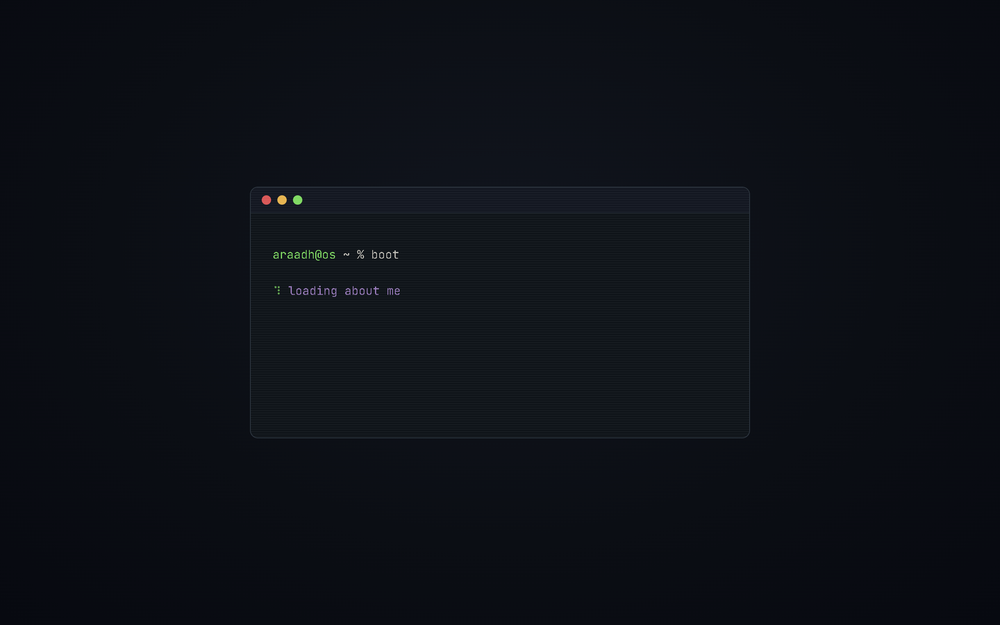
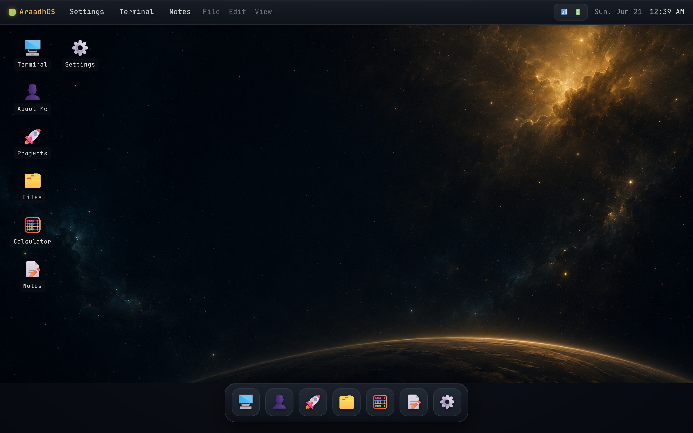
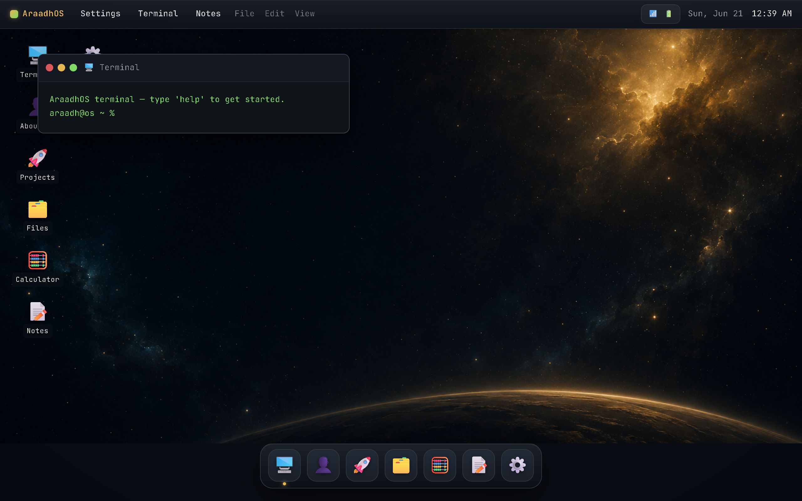
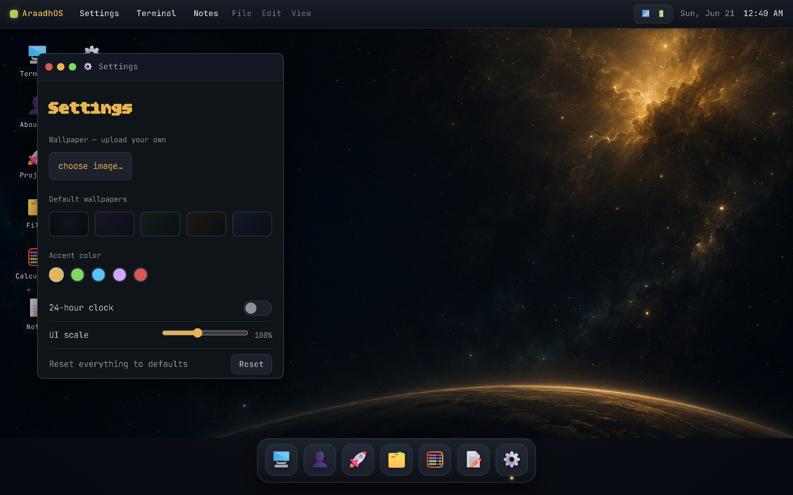

# AraadhOS

A personal operating system that lives in a browser tab. Boot it up, drag windows around, open a working terminal, tweak the theme — all built from scratch in vanilla **HTML, CSS, and JavaScript**. No frameworks, no build step, no dependencies.

> Introduction-to-software project, built with a lot of help and encouragement from [Hack Club](https://hackclub.com).

<!-- Replace the placeholder below with a screen recording of the OS booting + opening a couple of apps. A GIF or MP4 both render on GitHub. -->
<p align="center">
  
</p>

<p align="center">
  <a href="#live-demo"><b>Live Demo</b></a> ·
  <a href="#features">Features</a> ·
  <a href="#running-locally">Run Locally</a> ·
  <a href="#make-it-yours">Make It Yours</a>
</p>

---

## Live Demo

<!-- Drop your deployed URL here once GitHub Pages / Vercel is live. -->
**[araadhos.example.com](#)** *(update this link after deploying)*

---

## Screenshots

<!-- Swap these placeholders for real screenshots saved in the docs/ folder. -->

| Boot screen | Desktop |
| :---: | :---: |
|  |  |

| Terminal | Settings |
| :---: | :---: |
|  |  |

---

## Features

- **Boot sequence** — a terminal-style landing screen with a typing intro, a braille spinner, and a blinking ASCII mascot. Press `Enter` to power on.
- **Real window manager** — open, close, drag by the title bar, and click to focus (with rising z-index). Apps are single-instance and cascade so windows never stack perfectly on top of each other.
- **Dock** — frosted-glass dock with hover-lift, a click bounce, tooltips, and an indicator dot under every open app.
- **Desktop icons** — app shortcuts on the desktop surface; single-click to select, double-click to open.
- **Menu bar** — frosted-glass top bar with a live clock and date, plus quick launchers.
- **Persistent settings** — accent color, 12/24-hour clock, UI scale, and wallpaper, all saved to `localStorage` and restored on reload.

### Built-in apps

| App | What it does |
| --- | --- |
| **Terminal** | A genuinely working command interpreter (`help`, `ls`, `open`, `date`, `echo`, `clear`, and more). |
| **About Me** | Bio, skills, and links — rendered straight from a single data object. |
| **Projects** | Terminal-style listing of projects with tech stacks and links. |
| **Files** | A small, functional file browser. |
| **Calculator** | A clean, working calculator. |
| **Notes** | An auto-saving notepad with a live word/character counter, backed by `localStorage`. |
| **Settings** | Live theming — accent color, clock format, UI scale, and wallpaper. |

---

## Tech Stack

- **HTML** — structure
- **CSS** — frosted glass, animations, the ayu-dark palette, all hand-written
- **JavaScript** — window system, app registry, terminal, and persistence (no libraries)

The whole thing is driven by a small **app registry**: every app is just `{ name, icon, render() }` in one object. Add an entry and it automatically shows up in the dock, the desktop, the menu bar, and the terminal's `open` command.

---

## Running Locally

No build step, no install. Clone and open:

```bash
git clone https://github.com/Araadh3111/WebOS.git
cd WebOS
```

Then either open `index.html` directly in your browser, or serve it locally (recommended, so `localStorage` behaves consistently):

```bash
# Python 3
python -m http.server 8000
# then visit http://localhost:8000
```

---

## Make It Yours

All of your real content lives in one place — the `PROFILE` object near the top of `script.js`. Edit it and every app (About, Projects, Files) updates automatically. No HTML surgery required.

```js
const PROFILE = {
  name: "Araadh",
  tagline: "...",
  about: [ /* your bio paragraphs */ ],
  skills: [ /* ... */ ],
  links:  [ /* ... */ ],
  projects: [ /* ... */ ],
  files: [ /* ... */ ],
};
```

Want a new app? Write a `render(content)` function and add one line to the `APPS` registry — it'll appear everywhere on its own.

---

## Deploying

It's a static site, so any static host works:

- **GitHub Pages** — Settings → Pages → deploy from `main`, root folder.
- **Vercel / Netlify / Cloudflare Pages** — import the repo, no build command, output directory is the project root. On Vercel, set the Framework Preset to **Other**.

---

## Credits

Built by [Araadh](https://github.com/Araadh3111) as an intro-to-software project, with thanks to [Hack Club](https://hackclub.com).
